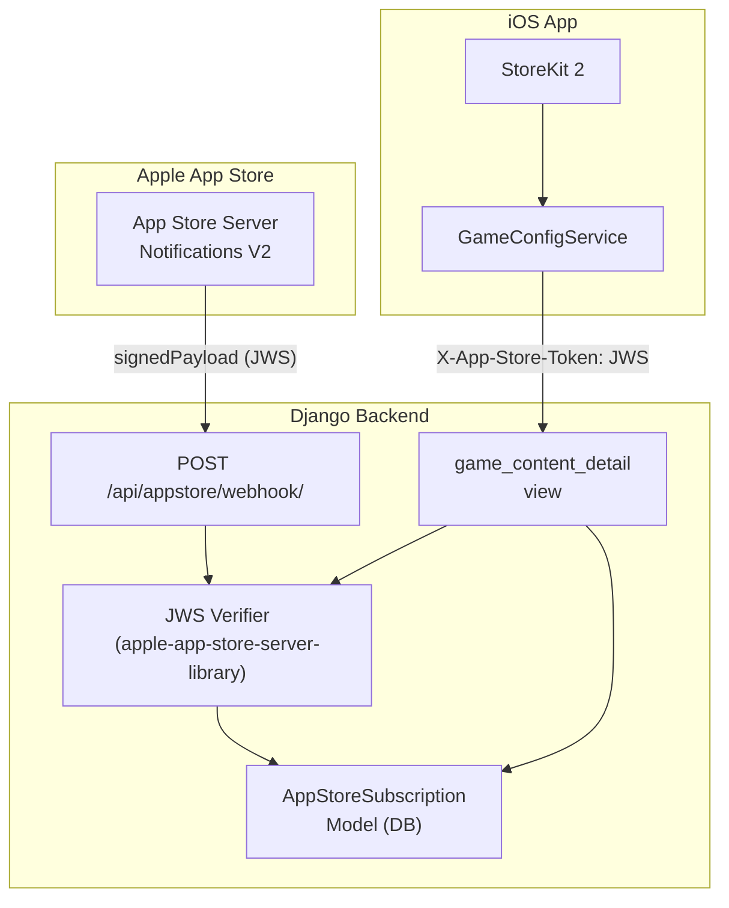

# App Store Server Integration

## Current State

- [game_content/views.py](PremiumServerDjango/game_content/views.py) has a stub `_verify_premium_entitlement()` that treats any non-empty token as premium
- iOS [GameConfigService.swift](ApplePlatforms/CarDriveDash/CarGame main/GameConfigService.swift) sends a token via `X-App-Store-Token` header, but the token format is undefined
- Subscription products: `plus.standard` (Standard, $2.99/mo) and `plus.premium` (Premium+, $3.99/mo) in group `3F19ED53`
- Only dependency is `Django>=5.0`

## Architecture




## Dependency

Add `apple-app-store-server-library` to [requirements.txt](PremiumServerDjango/requirements.txt). This is Apple's official Python library that handles:

- JWS signature verification against Apple's root certificates
- Decoding V2 notification payloads (signed transaction info, renewal info)
- Certificate chain validation

## New Django App: `appstore`

### Model: `AppStoreSubscription`

```python
class AppStoreSubscription(models.Model):
    original_transaction_id = models.CharField(max_length=255, unique=True, db_index=True)
    transaction_id = models.CharField(max_length=255)
    product_id = models.CharField(max_length=255, db_index=True)
    bundle_id = models.CharField(max_length=255)
    environment = models.CharField(max_length=20)  # "Sandbox" / "Production"
    expires_date = models.DateTimeField(null=True, blank=True)
    is_active = models.BooleanField(default=True, db_index=True)
    last_notification_type = models.CharField(max_length=100, blank=True)
    last_notification_subtype = models.CharField(max_length=100, blank=True)
    original_purchase_date = models.DateTimeField(null=True, blank=True)
    created_at = models.DateTimeField(auto_now_add=True)
    updated_at = models.DateTimeField(auto_now=True)
```

### Webhook View: `POST /api/appstore/webhook/`

- CSRF-exempt (Apple cannot send CSRF tokens)
- Receives `{"signedPayload": "<JWS>"}` from Apple
- Uses library's `SignedDataVerifier` to verify and decode
- Extracts `notificationType`, `signedTransactionInfo`, `signedRenewalInfo`
- Updates or creates `AppStoreSubscription` based on `originalTransactionId`
- Marks subscription inactive on `EXPIRED`, `REVOKE`, `REFUND`; active on `SUBSCRIBED`, `DID_RENEW`

### JWS Verification Utility: `appstore/verification.py`

- `verify_transaction_jws(token: str) -> dict | None` -- verifies a StoreKit transaction JWS sent by the iOS app
- Uses `SignedDataVerifier` from the Apple library
- Returns decoded transaction payload if valid, `None` if invalid
- `check_subscription_active(original_transaction_id: str) -> bool` -- DB lookup for active subscription

## Settings Additions in [base.py](PremiumServerDjango/config/settings/base.py)

```python
APPSTORE_BUNDLE_ID = os.environ.get("APPSTORE_BUNDLE_ID", "com.yourcompany.getawayrun")
APPSTORE_ISSUER_ID = os.environ.get("APPSTORE_ISSUER_ID", "")
APPSTORE_ENVIRONMENT = os.environ.get("APPSTORE_ENVIRONMENT", "Sandbox")  # "Sandbox" or "Production"
APPSTORE_SUBSCRIPTION_PRODUCT_IDS = ["plus.standard", "plus.premium"]
```

## Update [game_content/views.py](PremiumServerDjango/game_content/views.py)

Replace the stub `_verify_premium_entitlement()` with real verification:

1. **Primary: on-demand JWS verification** -- verify the JWS token from `X-App-Store-Token` header using `SignedDataVerifier`, check product ID is a subscription, check expiry date is in the future
2. **Fallback: DB lookup** -- if token verification identifies an `originalTransactionId`, also check the `AppStoreSubscription` table for up-to-date status (handles cases where Apple revoked/refunded via notification after the JWS was issued)

Clean up the debug logging code that is currently in the views.

## URL Wiring

In [config/urls.py](PremiumServerDjango/config/urls.py), add:

```python
path("api/appstore/", include("appstore.urls")),
```

## iOS App Update: [GameConfigService.swift](ApplePlatforms/CarDriveDash/CarGame main/GameConfigService.swift)

Update `fetchConfig()` to obtain the actual signed transaction JWS from StoreKit 2 and send it as the `X-App-Store-Token` header. The transaction's `jsonRepresentation` or the original JWS from `Transaction.currentEntitlements` provides this.

## Files to Create/Modify

- **Create**: `PremiumServerDjango/appstore/__init__.py`, `apps.py`, `models.py`, `views.py`, `urls.py`, `admin.py`, `verification.py`, `migrations/`
- **Modify**: `PremiumServerDjango/requirements.txt` (add dependency)
- **Modify**: `PremiumServerDjango/config/settings/base.py` (App Store settings, add app)
- **Modify**: `PremiumServerDjango/config/urls.py` (wire appstore URLs)
- **Modify**: `PremiumServerDjango/game_content/views.py` (real verification, remove debug code)
- **Modify**: `ApplePlatforms/CarDriveDash/CarGame main/GameConfigService.swift` (send real JWS token)

